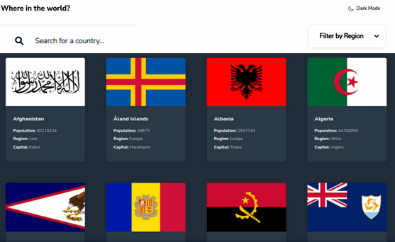

# Country-Info





### About App

An informative web application that provides detailed information about countries worldwide. Users can search for countries and view data such as population, capital, region, and more. Built with React and powered by a public REST API, this project demonstrates the integration of external data sources and the use of responsive design principles for a smooth user experience.


Features: 

- See all countries from the API on the homepage
- Search for a country using an input field
- Filter countries by region
- Click on a country to see more detailed information on a separate page
- Click through to the border countries on the detail page
- Toggle the color scheme between light and dark mode (optional)


## Getting Started

In order to view this project locally, you need to make sure you clone this repository and install it's dependencies.

### System Requirements

- [git][https://git-scm.com/] 2.31.1 or greater
- [node][https://nodejs.org/en/] 14.16.1 or greater
- [npm][https://nodejs.org/en/] 8.7.0 or greater

To check which versions you have installed you can run these commands:
```
git --version
node --version
npm --version
```
If requirements above are not installed in your computer, you'll need to install them. By clicking on them you can go to their website, which can lead you the way.

### Installation

- Clone the repository
  ```sh
  git clone https://github.com/feyuk/country-info.git
  ```
- Navigate to repository folder
  ```sh
  cd country-info
  ```
- Install npm packages
  ```sh
  npm install
  ```
- To run the app in the development mode run in the project directory: 
  ```sh
  npm start
  ```


